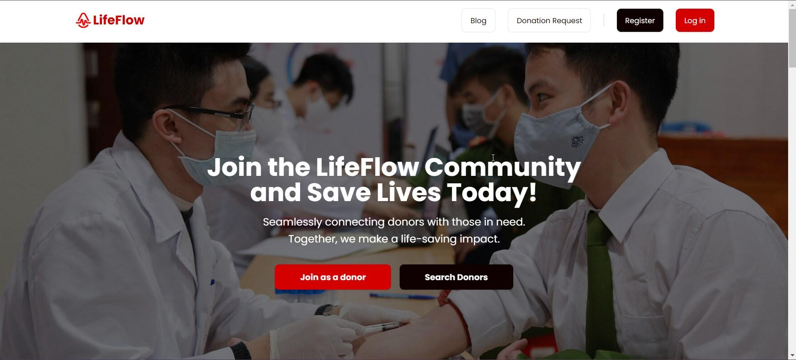

<div align="center">


# LifeFlow

Connecting Lives, One Donation at a Time

[Live Website](https://lifeflowclient.web.app)

</div>

## Introduction



The LifeFlow Blood Donation Application is a user-friendly platform that facilitates blood donation activities. It connects donors with those in need, streamlining the donation process. Built using the MERN stack (MongoDB, Express.js, React, Node.js), it includes features for user registration, blood donation requests, donor management, content management, and role-based access control.

## ✅ Features

- Visual appeal with pleasing color contrast and design.
- Navbar and footer on all pages (excluding 404-page).
- Meaningful footer with logo, name, copyright, contact information, social media links, and address.
- Navbar with website logo, name, Home, All Jobs, Applied Jobs, Add A Job, My Jobs, Blogs, and User Profile.
- Login page with Email/Password and Google Sign-in.
- Registration page with Name, Email, Password, and Photo URL.
- Relevant error messages on login and registration pages.
- Banner section on the home page with a slider, heading title, short description, and search input field.
- Job by category on the home page with a tab system (minimum 4 tabs).
- Each tab displays a minimum of 2 jobs with details like name, job title, posting date, deadline, salary range, and applicants number.
- Extra sections on the home page for additional content.
- Creation of a blog with answers to specific questions.
- Answers to questions like access token and refresh token, explanation of Express.js and Nest.js, and code explanation.
- Table/list on the All Jobs page displaying jobs posted by all users.
- Each row includes details like name, job title, posting date, deadline, salary range, and a details button.
- Search system on the All Jobs page based on job title.
- Private route for single job details accessible after clicking the View Details button.
- Displays company logo, job banner, job title, description, salary range, number of applicants.
- Apply button opens a modal with auto-filled user name and email, an input field for the resume link, and a submit application button.
- Prevents applications after the deadline.
- Private route for the Add A Job page accessible to logged-in users.
- Form on Add A Job page with fields for job banner URL, job title, logged-in user name, job category, salary range, job description, posting date, and application deadline.
- Updates job applicants number on applications.
- Private route for the My Jobs page showing jobs added by the logged-in user.
- Tabular form on the My Jobs page with update and delete buttons for each job.
- Private route for the Applied Jobs page showing jobs applied for by the logged-in user.
- Filter system on the Applied Jobs page based on job category.
- Custom 404 page with an interesting image/gif.
- Back to home button on the 404 page redirecting to the home page.
- Use of environment variables to hide sensitive information.
- Toasts/notifications for CRUD operations with meaningful messages.
- Meaningful Git commits and README documentation.
- Non-redirecting protected/private routes on reload.
- Responsive design for the home page.
- Implementation of JWT for two routes

## 📦 Client Packages

1. **Radix UI Dialog**
2. **Stripe React and Stripe JS**
3. **Tanstack React Query**
4. **AOS (Animate on Scroll)**
5. **Axios**
6. **DayJS**
7. **Firebase**
8. **Jodit React**
9. **React**
10. **React Router DOM**
11. **React Spinners**
12. **React to PDF**
13. **SweetAlert2**
14. **Swiper**
15. **emailJS**

# LifeFlow Backend Server

- Base API: <https://lifeflow-server.onrender.com/api/v1>
- Backup API: <https://lifeflow-server.vercel.app/api/v1>
- Server Health Check: <https://lifeflow-server.onrender.com/health>
- Backup Health Check: <https://https://lifeflow-server.vercel.app/health>

## 📦 Server Packages

- Mongoose
- Cors
- JWT
- Express
- Morgan
- Stripe
- Dotenv
- Cookie-Parser

## **Package Manager**

- pnpm

## Folder Structure

```md
lifeflow-server
 ┣ .vscode
 ┃ ┗ settings.json
 ┣ src
 ┃ ┣ api
 ┃ ┃ ┣ auth
 ┃ ┃ ┃ ┣ controllers
 ┃ ┃ ┃ ┃ ┣ createAuthCookie.js
 ┃ ┃ ┃ ┃ ┣ index.js
 ┃ ┃ ┃ ┃ ┗ removeAuthCookie.js
 ┃ ┃ ┃ ┗ index.js
 ┃ ┃ ┣ blog
 ┃ ┃ ┃ ┣ controllers
 ┃ ┃ ┃ ┃ ┣ addBlog.js
 ┃ ┃ ┃ ┃ ┣ deleteBlog.js
 ┃ ┃ ┃ ┃ ┣ getBlogs.js
 ┃ ┃ ┃ ┃ ┣ index.js
 ┃ ┃ ┃ ┃ ┣ updateBlog.js
 ┃ ┃ ┃ ┃ ┗ updateBlogStatus.js
 ┃ ┃ ┃ ┗ index.js
 ┃ ┃ ┣ funding
 ┃ ┃ ┃ ┣ controllers
 ┃ ┃ ┃ ┃ ┣ addPayment.js
 ┃ ┃ ┃ ┃ ┣ getAllFundings.js
 ┃ ┃ ┃ ┃ ┣ getFundingAmmount.js
 ┃ ┃ ┃ ┃ ┣ index.js
 ┃ ┃ ┃ ┃ ┗ paymentIntent.js
 ┃ ┃ ┃ ┗ index.js
 ┃ ┃ ┣ location
 ┃ ┃ ┃ ┣ controllers
 ┃ ┃ ┃ ┃ ┣ getDistricts.js
 ┃ ┃ ┃ ┃ ┣ getUpazilas.js
 ┃ ┃ ┃ ┃ ┗ index.js
 ┃ ┃ ┃ ┗ index.js
 ┃ ┃ ┣ request
 ┃ ┃ ┃ ┣ controllers
 ┃ ┃ ┃ ┃ ┣ deleteRequest.js
 ┃ ┃ ┃ ┃ ┣ getRequests.js
 ┃ ┃ ┃ ┃ ┣ getRequestsByStatus.js
 ┃ ┃ ┃ ┃ ┣ getTotalRequest.js
 ┃ ┃ ┃ ┃ ┣ index.js
 ┃ ┃ ┃ ┃ ┣ saveRequest.js
 ┃ ┃ ┃ ┃ ┣ updateReqStatus.js
 ┃ ┃ ┃ ┃ ┗ updateRequest.js
 ┃ ┃ ┃ ┗ index.js
 ┃ ┃ ┗ user
 ┃ ┃ ┃ ┣ controllers
 ┃ ┃ ┃ ┃ ┣ getDonors.js
 ┃ ┃ ┃ ┃ ┣ getTotalUsers.js
 ┃ ┃ ┃ ┃ ┣ getUser.js
 ┃ ┃ ┃ ┃ ┣ getUsers.js
 ┃ ┃ ┃ ┃ ┣ index.js
 ┃ ┃ ┃ ┃ ┣ saveUser.js
 ┃ ┃ ┃ ┃ ┣ updateUser.js
 ┃ ┃ ┃ ┃ ┣ updateUserRole.js
 ┃ ┃ ┃ ┃ ┗ updateUserStatus.js
 ┃ ┃ ┃ ┗ index.js
 ┃ ┣ config
 ┃ ┃ ┗ index.js
 ┃ ┣ db
 ┃ ┃ ┗ connectDB.js
 ┃ ┣ lib
 ┃ ┃ ┗ auth
 ┃ ┃ ┃ ┗ createToken.js
 ┃ ┣ middlewares
 ┃ ┃ ┣ applymiddleware.js
 ┃ ┃ ┗ verifyToken.js
 ┃ ┣ models
 ┃ ┃ ┣ Blog.js
 ┃ ┃ ┣ District.js
 ┃ ┃ ┣ Funding.js
 ┃ ┃ ┣ Request.js
 ┃ ┃ ┣ Upazila.js
 ┃ ┃ ┗ User.js
 ┃ ┣ routes
 ┃ ┃ ┣ auth
 ┃ ┃ ┃ ┗ index.js
 ┃ ┃ ┣ blog
 ┃ ┃ ┃ ┗ index.js
 ┃ ┃ ┣ funding
 ┃ ┃ ┃ ┗ index.js
 ┃ ┃ ┣ location
 ┃ ┃ ┃ ┗ index.js
 ┃ ┃ ┣ request
 ┃ ┃ ┃ ┗ index.js
 ┃ ┃ ┗ user
 ┃ ┃ ┃ ┗ index.js
 ┃ ┣ utils
 ┃ ┃ ┣ error.js
 ┃ ┃ ┣ mongoose.js
 ┃ ┃ ┗ router.js
 ┃ ┗ app.js
 ┣ .gitignore
 ┣ LICENSE
 ┣ index.js
 ┣ package.json
 ┣ pnpm-lock.yaml
 ┣ reame.md
 ┗ vercel.json
```

## License

This project is licensed under the GNU General Public License v3.0 - see the [LICENSE](./LICENSE) file for details.
